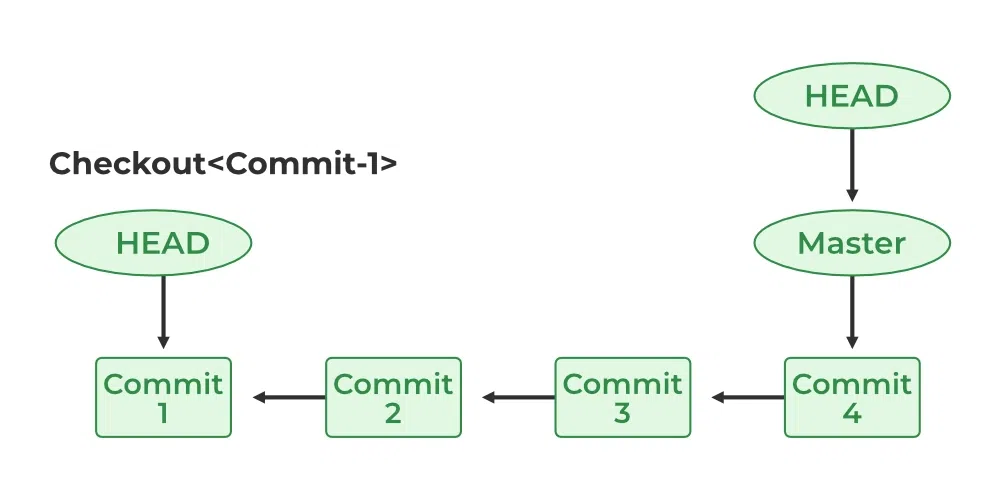

# HEAD

Voltar para o [Glossário](README.md).

No Git, `HEAD` é a referência para o commit mais atual do repositório. Se você sabe o que é uma _Lista Ligada_, a HEAD é o ponteiro para o último [commit](commit.md) de uma [branch](branch.md). Sempre que um novo commit é feito, a HEAD atualiza para apontar para ele, então ela é uma referência consistente que você pode usar para ver o estado atual da branch, com `git show HEAD` e voltar ao ponto atual com `git checkout HEAD`.

Fonte: GeeksforGeeks.

> **TLDR;** `HEAD` é um outro nome para o commit mais recente de uma branch.

## Referências

[GeeksforGeeks. "Git - Head"](https://www.geeksforgeeks.org/git/git-head/)
