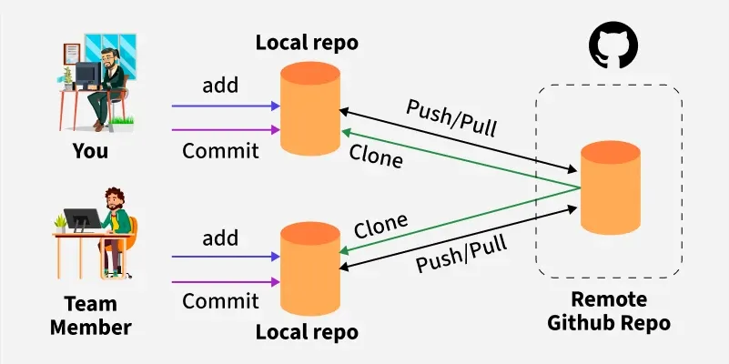

# Repositório

Voltar para o [Glossário](README.md).

Um **repositório** do Git é o local onde os arquivos do seu projeto e o histórico de alterações são armazenados. A diferença entre a pasta de um projeto _não-versionado_ e um repositório git (_versionado_) é que o segundo contém uma pasta oculta chamada `.git` que contém arquivos para controlar o versionamento (o histórico) do seu projeto, ou seja isso lhe permite:

- Guardar todos os arquivos, histórico e _branches_.
- Controlar a versão do seu projeto, então você pode navegar por versões antigas e restaurá-las.
- Colaborar com outros desenvolvedores: dois desenvolvedores podem trabalhar em um projeto ao mesmo tempo sem sobreescrever as alterações um do outro.
- Armazenar o seu projeto remotamente em ferramentas como o Github, Gitlab ou Codeberg.

Além disso, o comando `git` ou o Github Desktop só funcionam dentro de repositórios, o repositório é nossa bancada de trabalho, e as operações git, nossas ferramentas.

Repositório também é como chamamos o estágio final de trabalho no Git. Você começa com alterações no [Working Directory](working_directory.md), move elas para a [Staging Area](staging_area.md) e ao salvá-las, elas entram para o **estado de repositório**, ou seja você tem uma cópia permanente do estado do seu projeto.

## Obtendo um Repositório

Existem duas formas de obter um repositório do git, você pode **criar** um, ou **clonar** um. Dependendo do seu trabalho, uma operação pode ser mais comum que a outra. Vamos explorar as duas ideias e falar sobre dois tipos de repositórios.

1. **Criando a partir de um diretório existente**:

A primeira opção para criar um novo repositório é pegar um diretório/pasta que você tenha no seu computador &mdash; por exemplo um projeto seu &mdash; e transformá-lo em um repositório. Usando o comando [`git init`](../guia_comandos/git_init.md). Ao fazer isso, você terá um repositório dentro do seu computador, chamamos isso de um **repositório local**, pois ele está localizado localmente na sua máquina.

2. **Clonando um repositório remoto**:

A segunda alternativa é buscar um projeto já existente, hospedado (outro jeito de falar armazenado) remotamente na rede, por isso chamamos esses repositórios de **remotos**, e _cloná-los_ ou seja adquirir uma cópia dele incluíndo todos os arquivos e histórico de alterações. Desse jeito, vários desenvolvedores podem clonar um repositório remoto (criando seus repositórios locais em seus próprios computadores), realizar mudanças no projeto ao mesmo tempo e enviar suas alterações para o remoto, essas alterações, então, podem ser combinadas em uma operação chamada de _merge_. Em seguida, os desenvolvedores podem sincronizar a sua cópia local com a versão mais recente do remoto e repetir o processo. Esse fluxo é a base do desenvolvimento de software e falamos mais sobre isso no capítulo de [Workflows](../guia_workflow/README.md).

A imagem abaixo para entender melhor como esse fluxo funciona e os tipos de repositórios.

Fonte: GeeksForGeeks.

> **TLDR;** um repositório é a pasta raíz do seu projeto, dentro dela existe uma pasta chamada `.git` que armazena o histórico de alterações, não apague essa pasta! Use `git init` ou `git clone` para criar/clonar um repositório.

Por fim, veja o nosso [Guia Prático](../guia_pratico/README.md) para ver como baixar o git e criar o seu primeiro repositório.

## Referências

- [GeeksforGeeks, 2026. "What is a Git Repository?"](https://www.geeksforgeeks.org/git/what-is-a-git-repository/)
- [Livro Fundamentos de Git. "Cápitulo 2.1 - Obtendo um Repositório Git"](https://git-scm.com/book/pt-br/v2/Fundamentos-de-Git-Obtendo-um-Reposit%C3%B3rio-Git)
