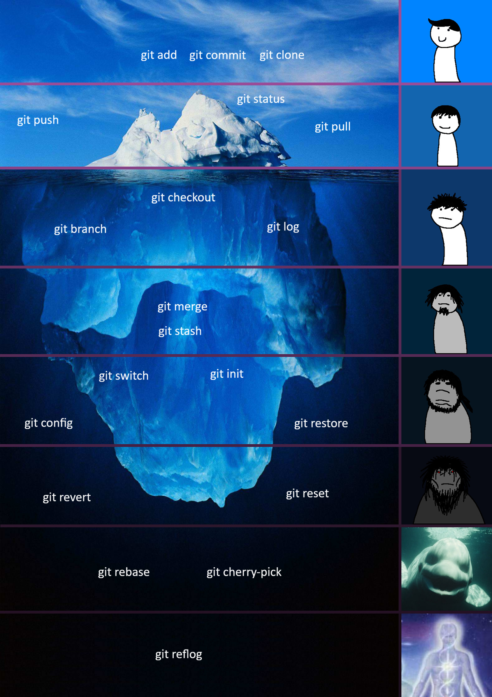

# Guia de Comandos

> Esse espaço é reservado para todos os comandos relevantes que você vai utilizar no seu dia a dia com Git e GitHub. Aqui, você encontrará uma lista organizada de comandos, suas descrições, flags relevantes e exemplos de uso para facilitar sua consulta rápida.

Voltar ao [README Principal](../README.md)

## Iceberg de Comandos

Em meio a tantos comandos disponíveis, existem aqueles que iremos utilizar constantemente durante o desenvolvimento, enquanto existem aqueles que serão utilizados em situações muito específicas ou de emergência (quando você sente que tudo está perdido e não tem mais nada a fazer). Para ilustrar isso, criamos uma imagem extremamente debatível de um **Icerberg de Comandos**. Sinta-se a vontade para apreciar!

> Observação: a imagem reflete apenas a opinião pessoal do autor, e não deve ser levada como uma verdade absoluta. Afinal, a utilidade de um comando pode variar muito dependendo do contexto e do projeto em que você está trabalhando. O importante é conhecer os comandos e saber quando utilizá-los, para que você possa escolher a melhor opção para cada situação.

## Sumário

- [git init](git_init.md)
- [git status](git_status.md)
- [git add](git_add.md)
- [git commit](git_commit.md)
- [git branch](git_branch.md)
- [git checkout](git_checkout.md)
- [git log](git_log.md)
- [git stash](git_stash.md)
- [git merge](git_merge.md)
- [git rebase](git_rebase.md)
- [git reset](git_reset.md)
- [git revert](git_revert.md)
- [git cherry-pick](git_cherry_pick.md)
- [git push](git_push.md)
- [git pull](git_pull.md)
- [git clone](git_clone.md)
- [git config](git_config.md)
- [git switch](git_switch.md)
- [git restore](git_restore.md)
- [git reflog](git_reflog.md)
- [git remote](git_remote.md)
- [git fetch](git_fetch.md)
