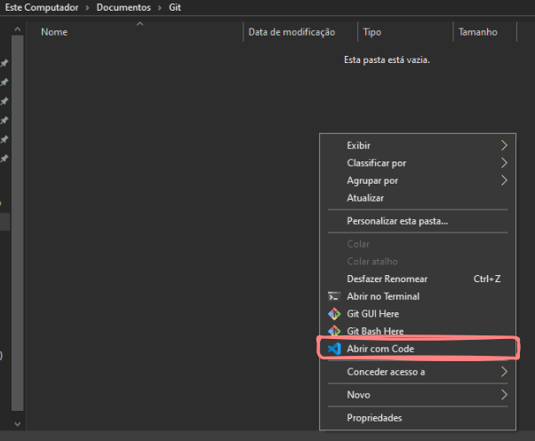
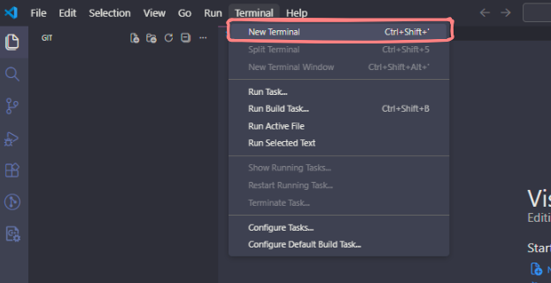
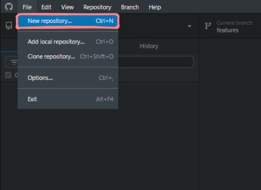
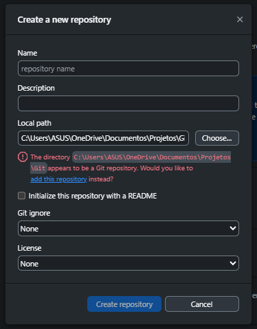

# Criando um Repositório

## Fazendo manualmente

Para iniciarmos, crie uma pasta em um lugar de fácil acesso do seu PC. Ela servirá de [repositório](../glossario_conceitos/repositório.md) local para os nossos futuros trabalhos. Agora, com a pasta criada, basta abrí-la com o VSCode, seja pelo explorador de arquivos, seja pelo terminal com o comando `code <caminho-da-pasta>`.

Com o VSCode aberto, será de extrema importância também deixarmos uma instância do terminal aberta, para executarmos todos comandos do Git que virão a seguir. Para isso, podemos ir no canto superior esquerdo e abrir um novo terminal (o atalho para facilitar sua vida é `Ctrl+Shift+'`). Posicione ele da melhor maneira que achar na sua tela.

Com os preparativos iniciais feitos, podemos finalmente executar o comando [`git init`](../guia_comandos/git_init.md). Como você deve ter notado, nada aparentemente mudou, exceto por uma mensagem no terminal. No entanto, tudo aconteceu como planejado. Se a opção de exibir "Itens ocultos" estiver habilitada no seu explorador de arquivos, você pode verificar que uma pasta `.git` surgiu. Ela naturalmente fica oculta porque é nela que toda a magia acontece, sem que precisemos mexer em nada! Por esse motivo, iremos deixá-la ai mesmo, quietinha e intocada.

## Pelo GitHub Desktop

De forma análoga, podemos simplificar um pouco esse processo pelo GitHub Desktop. Com ele aberto, podemos ir no canto superior esquerdo e dentro de "Arquivos" clicamos em "Novo Repositório".

Ao fazer isso, uma tela com um pequeno formulário será aberta, onde será pedido:
- **Nome do [repositório](../glossario_conceitos/repositório.md)**;
- **Descrição**: texto curto que descreve o seu projeto;
- **Caminho local**: caminho para a pasta onde deseja iniciá-lo (observe que, como eu já segui o caminho manual, minha pasta já possui um repositório Git, logo deveria clicar na opção "adicionar esse repositório");
- **Inicializar repositório com README**: esse arquivo é formatado em **markdown**, um tipo de linguagem que te possibilita formatar texto de forma muito simples; sua função, nesse caso, é ser o arquivo de faixada do seu repositório, onde irá conter informações importantes sobre seu projeto;
- **Git ignore**: esse arquivo serve para dizer ao Git que tipos de arquivo, caminhos ou padrões você quer que sejam ignorados ao fazer um [commit](../glossario_conceitos/commit.md) (informações sensíveis, arquivos de cache e módulos de instalação geralmente estão nessa lista); pela ferramenta, ela te fornece uma lista de linguagens, mas como não iremos trabalhar com nenhuma delas, podemos simplesmente *ignorar* essa opção;
- **Licença**: documento legal que define os termos de uso, distribuição e modificação do seu projeto; existem diversos tipos de licença, cada uma com suas particularidades, mas como não iremos trabalhar com nenhuma linguagem específica, podemos simplesmente *ignorar* essa opção também. Para achar a licença ideal para o seu projeto, acesse [aqui](https://choosealicense.com/).

Ao criar o repositório, a mágica foi feita novamente! Uma pasta `.git` surgiu no caminho específicado, junto a outros arquivo caso tenha marcado as respectivas opções.

