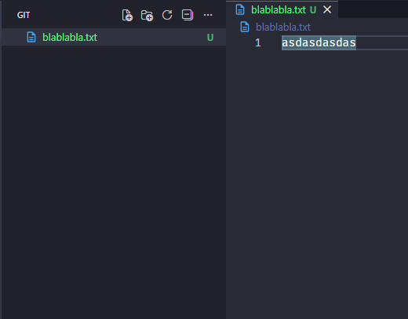
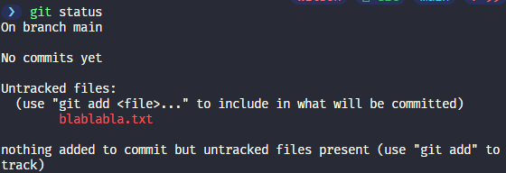
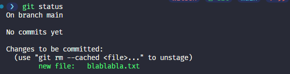
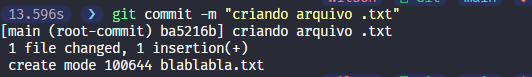
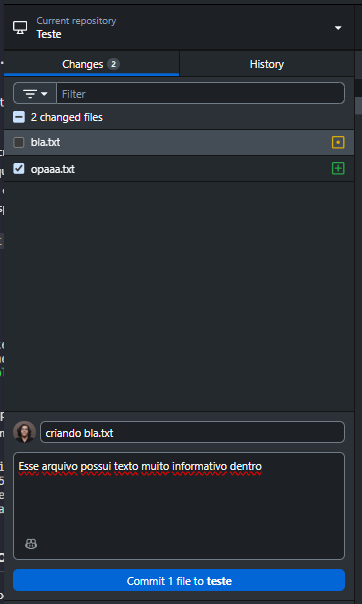
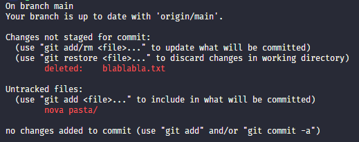
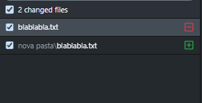
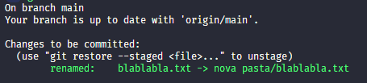
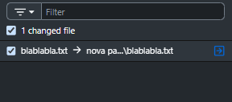

# Fazendo Commits

Voltar ao [Guia Prático](README.md)

## Fazendo manualmente

Com o [repositório](../glossario_conceitos/repositorio.md) criado, podemos começar a fazer [commits](../glossario_conceitos/commit.md). Tecnicamente, um commit é um nó que aponta para o commit pai (o anterior) e guarda uma *snapshot* — um "print" do estado atual do projeto naquele momento, com todos os arquivos e linhas de código. Ou seja, podemos observar um repositório como sendo basicamente um "grafo" direcionado, sempre apontando pra trás.

Como não iremos trabalhar com nenhuma linguagem específica, o tipo de arquivo que usaremos aqui para fins didáticos será o `.txt`, mas é óbvio que no seu dia dia você terá contato com ínumeras extensões de arquivos. Portanto, crie um no seu repositório e escreva qualquer baboseira dentro. Pelo VSCode, observe que o nome do arquivo ficará em verde na aba lateral, junto a uma letra "U", que significa *Untracked*. Isso quer dizer que o Git detectou que um arquivo surgiu/foi modificado.



Isso pode ser visto melhor através do comando [`git status`](../guia_comandos/git_status.md), o qual te fornece algumas informações valiosas.



Portanto, para que nossas incríveis mudanças possam valer de algo, precisamos usar o comando [`git add .`](../guia_comandos/git_add.md) (o ponto "." aqui serve para indicar que queremos adicionar **TODOS** os arquivos da pasta atual (que nesse caso é só o .txt)). Agora, na lateral esquerda, é possível ver que o "U" foi trocado por um "A", que significa *Added*. Antes, as mudanças estavam somente no seu [working directory](../glossario_conceitos/working_directory.md), mas agora elas passaram para a [staging area](../glossario_conceitos/staging_area.md). Talvez você se pergunte qual a utilidade do comando de *adicionar*: não poderíamos simplesmente *commitar* direto? E a resposta é NÃO! A ideia aqui é que você pode e DEVE separar "pedaços" de trabalho (uma mudança num estilo específico, a resolução de um bug, a adição de uma feature, etc.). Manter separado em *commits* diferentes te ajuda a organizar melhor o histórico do seu projeto, facilita a identificação de mudanças específicas e qual desenvolvedor a fez. E como você faz essa separação? Fazendo o `git add` somente dos arquivos que você quer enviar naquele momento! Legal, não?

Novamente, o comando `git status` pode mostrar um pouco mais do que foi feito após o comando.



Com a mudança adicionada, podemos *commitá-la* (se acostume com essa junção de português e inglês haha) - o que significa que as mudanças selecionadas a dedo serão finalmente enviadas para o [repositório](../glossario_conceitos/repositório.md). Para tal, usaremos o comando [`git commit -m <mensagem-do-commit>`](../guia_comandos/git_commit.md) (o `-m` aqui é de "mensagem"). A mensagem do commit costuma e deve ser sucinta, descrevendo somente o necessário. Enviado o comando, seu primeiro commit foi feito! Se você está se perguntando como, de repente, editar um commit que acabou de ser enviado, ou se não desfazer um commit que ficou lá pra trás no histórico, não se preocupe, isso será tudo abordado no capítulo de [Desfazendo Caquinhas](../guia_pratico/11_desfazendo_caquinhas.md), então continue lendo!



## Pelo GitHub Desktop

Pelo programa, todo esse processo manual fica muito mais simples (mas também muito mais sem graça haha). No dia a dia, é o mais provável que você use, tanto pela facilidade tanto quanto pela praticidade.

Com o programa aberto já no repositório que estamos trabalhando, será possível observar uma aba lateral onde todos os arquivos que foram modificados estarão listados. Para fins didáticos, criei mais um arquivo .txt para incrementar a lista. O equivalente ao `git add` seria selecionar ou não arquivos dessa lista, através da caixinha de seleção à esquerda. Após selecionar somente os arquivos que queremos *commitar*, podemos adicionar um título para o commit, juntamente com sua descrição. E voilà, o `git commit` também foi feito!



## Tópicos complementares

### Movendo pastas da forma correta

Mover pastas geralmente é uma tarefa trivial, mas quando falamos de Git, é importante fazer isso da forma correta ou erros catastróficos podem acontecer. Imagine o seguinte: se você possui um arquivo e move para uma pasta nova, infelizmente o Git não é superdotado e irá interpretar que, na realidade, você removeu o arquivo antigo e criou um novo naquela pasta. Se você fizer isso e outra pessoa estiver trabalhando ainda na versão antiga (a qual não foi movida), o Git irá deixar de rastrear as mudanças corretamente, afinal, no sistema, é como se fossem dois arquivos completamente diferentes. Tá vendo o quão problématico um problema tão banal pode ser? E pra resolver, é tão simples quanto esse problema: 

- depois de mover o arquivo, podemos ver o status atual dos arquivos com `git status`, e como é possível ver, o arquivo "antigo" está como deleted e o novo, "untracked" (no GitHub Desktop, um está marcado como deletado e o outro como adicionado):




- para consertar, usamos `git add -A`, o que irá adicionar tanto o arquivo novo quanto o antigo, e o Git irá entender que eles são o mesmo arquivo, só que em lugares diferentes.

- para observar o resultado, basta usar `git status` novamente, e agora ambos os arquivos estão como "renamed" (já que na prática mover um arquivo é adicionar ou remover o prefixo de uma pasta):




> Observação: se o conteúdo do arquivo for MUITO diferente do original, mesmo com esse procedimento o Git não conseguirá identificar que se trata do mesmo arquivo. Por isso, uma boa prática é fazer um commit primeiro movendo os arquivos e depois realizando as modificações.

Pronto! Agora você nunca mais terá problemas ao mover arquivos e pastas, e o histórico do seu projeto continuará limpo e organizado.

### Padrões de mensagem de commit

Quando fazemos um commit, queremos passar o máximo de informação possível de forma breve e clara. Para isso, existem alguns padrões de mensagens de commit que são amplamente utilizados pela comunidade, como o [Conventional Commits](https://www.conventionalcommits.org/en/v1.0.0/). Através dele, é possível identificar o tipo de mudança e o escopo dela, ou seja, a parte do código que foi afetada. O primeiro passo é identificar o tipo de mudança. A seguir, temos uma tabela com os tipos mais comuns, suas descrições e exemplos de mensagens de commit:

| Tipo     | Descrição                                                                | Exemplo de Commit                               |
|----------|--------------------------------------------------------------------------|-------------------------------------------------|
| feat     | Adiciona um novo recurso ao código                                       | feat(auth): adiciona login com JWT              |
| fix      | Corrige um bug no código                                                 | fix(api): corrige erro ao buscar usuário        |
| docs     | Alterações apenas na documentação (ex: README)                           | docs(readme): adiciona instruções de instalação |
| style    | Alterações de formatação (lint, espaços, ponto e vírgula, etc.)          | style: corrige indentação do código             |
| refactor | Refatorações que não alteram a funcionalidade                            | refactor(user): simplifica validação de email   |
| chore    | Tarefas de manutenção/configuração (ex: .gitignore, pacotes)             | chore: atualiza dependências do projeto         |

Depois, é opcional (mas recomendado) colocar o escopo da mudança entre parênteses, logo após o tipo. O escopo é a parte do código que foi afetada pela mudança, como um módulo, componente ou função específica. 

Por exemplo:

```feat(guia): adiciona capítulo sobre mensagens de commit```

Algumas boas práticas são:

- Use verbos no imperativo: “adiciona”, “corrige”, “remove”
- Seja específico, evite mensagens genéricas como “ajustes”
- Mantenha a mensagem curta e informativa
- Use escopo sempre que fizer sentido

Desse modo, seus commits ficarão muito mais organizados e informativos, e aqueles que os lerem no futuro (incluindo você mesmo) agradecerão por isso!

