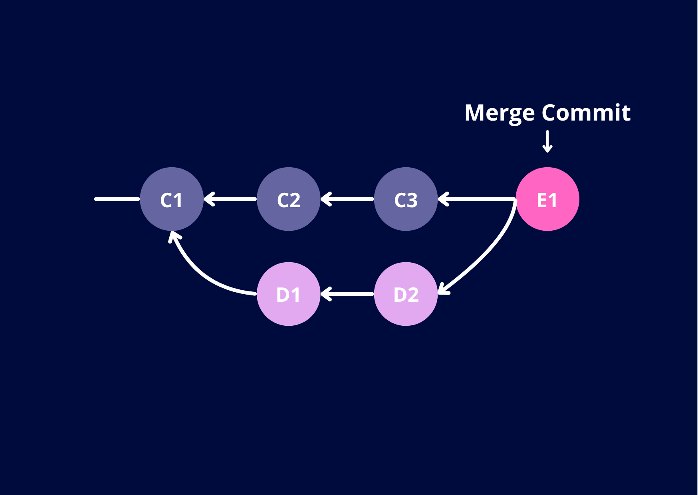
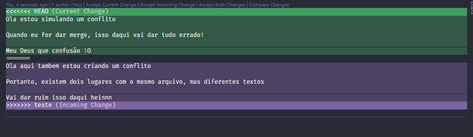
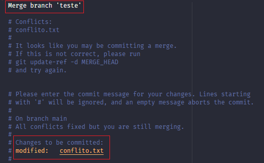
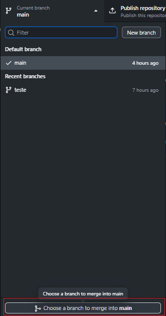
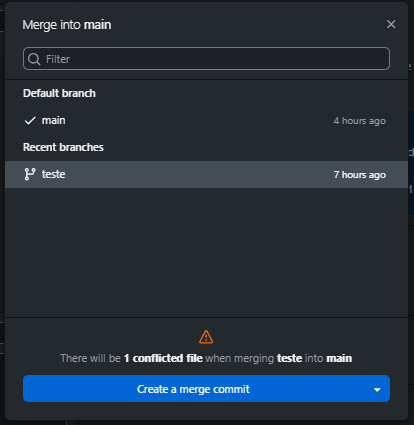
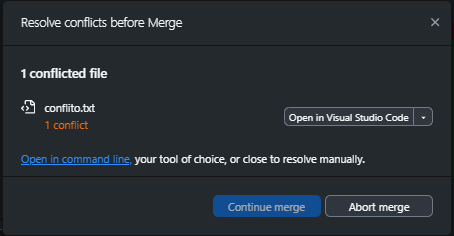
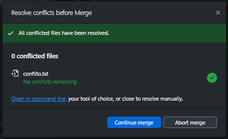

# Unindo Branchs

## Fazendo manualmente

Agora que entendemos como ramificar o trabalho dentro de um repositório (e como navegar nele), vamos aprender a uní-lo novamente. 

Assim, queremos que as alterações que foram feitas na outra branch também estejam presentes na `main`, e faremos isso através de um [merge](../glossario_conceitos/merge.md). Esse processo é muito comum quando, em algum projeto, uma feature isolada foi implementada, testada e revisada, e agora pode finalmente ser unida ao resto do projeto. Para fazê-lo, primeiro navegar para a branch que queremos que receba as alterações (nesse caso, a `main`). Feito isso, basta usar o comando `git merge teste`, onde `teste` é o nome da branch que queremos unir. O Git irá analisar as diferenças entre as duas branches e tentar combiná-las. Se tudo deu certo, um novo commit, chamado de `merge commit`, será criado, indicando que as alterações foram unidas. O merge commit tem dois pais, ou seja, ele aponta para os últimos commits de ambas as branches, o que basicamente indica que a união deu certo.

No entanto, nem sempre o `merge` funciona de primeira. Num mundo perfeito de desenvolvimento, as branchs crescem paralelamente, ou seja, elas não mexem nos mesmos arquivos, e o merge é feito de forma automática. Mas, na vida real, isso nem sempre acontece. Imagine que, por algum motivo, dois devs, cada um em sua branch, mexeram no mesmo arquivo, e em linhas próximas. O Git não tem como advinhar qual versão do arquivo deve ser mantida, e é aí que surge o famoso [merge conflict](../glossario_conceitos/merge_conflict.md). Ele irá indicar quais são os arquivos que estão em conflito e marcar as partes conflitantes dentro desses arquivos. Para resolver o conflito, é necessário abrir o arquivo e escolher quais mudanças devem ser mantidas. O Git marca as partes conflitantes com símbolos especiais, como `<<<<<<<`, `=======` e `>>>>>>>`, para indicar as diferentes versões do código.

Para entender na prática, vamos simular um conflito. Para isso, vamos criar um arquivo `conflito.txt` na branch `main`, escrever algo aleatório nele e commitar. Depois disso, vamos navegar para a branch `teste`, criar um arquivo com o mesmo nome, `conflito.txt`, mas com um conteúdo totalmente diferente e commitar. Feito isso, vamos tentar fazer o merge da branch `teste` para a `main`. O Git irá detectar o conflito e indicar que o arquivo `conflito.txt` está em conflito.

No editor de código, as partes conflitantes ficam um pouco mais claras. No exemplo acima, a parte entre `<<<<<<< HEAD` e `=======` (que está em verde) é a versão do arquivo presente na branch `main`, enquanto a parte entre `=======` e `>>>>>>> teste` (que está em roxo) é a versão do arquivo presente na branch `teste`. Para resolver o conflito, temos algumas opções: aceitar as mudanças da `main` (da branch atual) com **Accept Current Changes**, aceitar as mudanças da `teste` (da branch que estamos tentando unir) com **Accept Incoming Changes**, ou aceitar ambas as mudanças com **Accept Both Changes**. Além disso, também existe a opção de resolver o conflito manualmente, removendo essas marcações e editando e mantendo apenas o que for necessário. 

Depois disso, é preciso adicionar os arquivos resolvidos com `git add`, e depois finalizar o merge ou com um commit, ou com `git merge --continue`. Caso use essa última opção, seu editor de código irá abrir, mostrando todos os commits que serão mesclados e para que você escreva a mensagem do merge commit. Após escolher a mensagem, basta salvar e fechar o editor, e o merge será finalizado!

Se no meio dessa bagunça toda você perceber que não queria ter dado o comando `git merge`, que ele é muito complexo e que você não tem certeza de como resolver os conflitos, não se preocupe! O Git tem um comando para cancelar o merge, que é o `git merge --abort`. Ele irá desfazer todas as alterações feitas pelo merge e retornar o repositório ao estado em que estava antes do merge. 

## Pelo Github Desktop

Pelo software, como de praxe, o procedimento é bem simples: na aba de branchs, selecione a branch alvo do merge (no nosso caso, a `main`), e depois cloque em **Choose a branch to merge into main** (escolha uma branch para unir com a main).

Feito isso, outra interface irá aparecer, mostrando as branchs disponíveis para merge. Selecione a branch que deseja unir (no nosso caso, a `teste`), e clique em **Create a merge commit** (crie um commit de merge). Observe que, se houver algum conflito, ele será constatado logo acima do botão

Clicando no botão, será listado todos os arquivos que estão em conflito junto a uma opção para abrir no editor código justamente para resolvê-lo. Ao abrir esses arquivos, as mesmas opções de resolução de conflitos estarão disponíveis: aceitar mudanças atuais, aceitar mudanças recebidas ou aceitar ambas.

Após todos os arquivos conflitantes terem sido resolvidos, basta clicar em **Continue merge** (continuar merge), e o merge será finalizado! Assim como no terminal, é possível abortar o merge a qualquer momento, clicando em **Abort merge** (abortar merge), e o repositório irá voltar ao estado em que estava antes do merge.

Com isso, as alterações da branch `teste` agora estão presentes na `main`, e o merge foi concluído com sucesso!