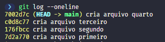
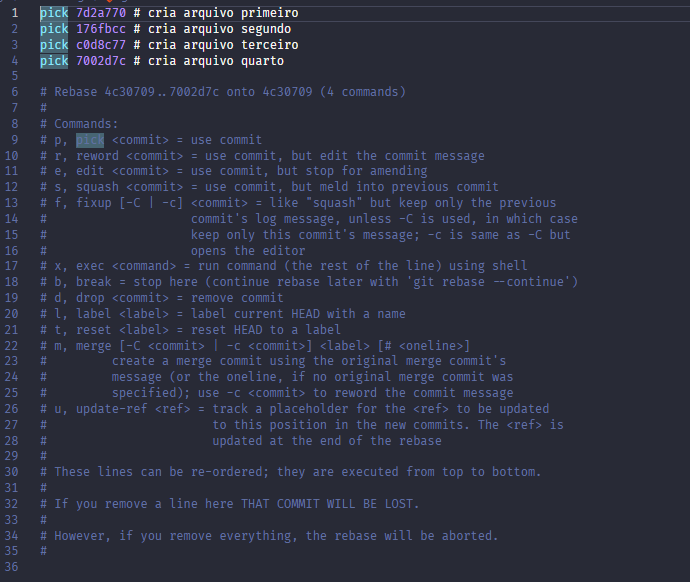
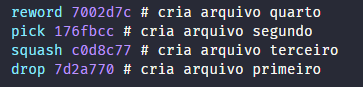
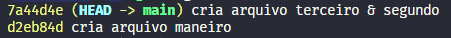

# Alterando o histórico

Quando estamos trabalhando locamente em um projeto, é comum que, por algum motivo, tenhamos que alterar o histórico de commits. Seja para corrigir um erro, para melhorar a mensagem de um commit ou para reorganizar os commits de uma branch. Uma forma muito poderosa de fazer isso é através do comando [`git rebase -i`](../guia_comandos/git_rebase.md) (esse "-i" vem de iterativo). De forma geral, ele permite que você altere coisinhas específicas dos commits até um certo ponto (o qual você mesmo determina). 

Para fins didáticos, o que fiz foi criar mais alguns arquivos e alguns commits, para que tenhamos um histórico mais complexo para *brincar*. O resultado disso é o seguinte:

> Importante: sempre tenha conhecimento do seu histórico de commits antes de usar o `git rebase -i`

Para "brincarmos" com essa ideia de alterar o histórico, vamos juntar algums commits, deletar um segundo e editar a mensagem de um terceiro. Para isso, vamos usar o comando `git rebase -i HEAD~4`, onde `HEAD~4` indica que queremos alterar os últimos 4 commits do histórico. Se, ao invés de usar o [`HEAD`](../glossario_conceitos/head.md) nós quiséssemos usar o hash de um commit específico, bastaria saber o hash do commit que está logo ATRÁS do commit que queremos alterar, ou seja, o pai do último commit alterado (nesse caso aqui, seria o pai do quarto commit, ou seja, o quinto commit). Feito isso, o Git irá abrir seu editor de código, mostrando os últimos 4 commits do histórico, e um bocado de textos.

Aqui, irei sintetizar as opções mais importantes que podem ser usadas para cada commit:
- `pick`: mantém o commit como ele está, sem alterações. Literalmente não faz nada com ele, apenas o "pega" e o mantém no histórico.
- `reword`: mantém as alterações do commit, mas permite que a mensagem do commit seja editada. Ou seja, o conteúdo do commit permanece o mesmo, mas podemos alterar algum erro de digitação ou melhorar a mensagem do commit.
- `squash`: combina um commit com o commit anterior à ele. Serve para juntar commits que foram feitos de forma muito fragmentada ou simplesmente para juntar commits que deveriam ter sido feitos juntos desde o início.
- `drop`: remove o commit do histórico (pode ser feito simplesmente deletando a linha do commit ou comentando ela, ou seja, colocando um "#" no início da linha do commit).

> Observação¹: ainda existe a opção de mudar a ORDEM dos commits, o que pode ser feito simplesmente mudando a posição das linhas dos commits.
> Observação²: no editor de código, os commits mais acima são os mais antigos, e os commits mais abaixo são os mais recentes. 

Agora que sabemos as opções, vamos começar os trabalhos! Primeiro, troquei o primeiro commit com o último commit, portanto o "criar arquivo quarto" agora irá vir antes no histórico de commits. Depois, usei a opção `squash` para juntar o terceiro commit com o segundo, e essa ordem é MUITO importante. Lembra que quem está acima vem primeiro? Portanto, o `squash` deve ser feito de baixo para cima, ou seja, o commit que queremos juntar deve estar abaixo do commit com o qual ele será juntado. Talvez você se pergunte o que acontece caso tenham vários commit seguidos com `squash`, e a resposta é simples: eles serão unidos àquele commit que está mais acima que não seja um `squash`. Por fim, usei ainda a opção `reword` no "cria arquivo quarto", que serve para mudar sua mensagem, e `drop` no "cria arquivo primeiro", para deletar esse commit por completo do histórico. O resultado disso no editor de código é o seguinte:

Feito isso, basta salvar o arquivo e fechar o editor de código OU usar o comando `git rebase --continue`. Como usamos um `reword`, o Git irá abrir o editor de código novamente, mas dessa vez apenas para editarmos a mensagem do commit "cria arquivo quarto" (usamos o mesmo procedimento para salvar). Por fim, como usamos também o `squash`, o Git irá abrir o editor de código mais uma vez, mas dessa vez para editarmos a mensagem resultante da junção dos commits, e para escolhe-lá basta comentar tudo que você não quer que esteja na mensagem final (colocando um "#" no início da linha). Com tudo salvo, o resultado final do histórico de commits é o seguinte:

Observe que interessante:
- o "cria arquivo primeiro" sumiu por completo;
- o "cria arquivo quarto" se transformou em "cria arquivo maneiro" e, se compararmmos os hashs, veremos que ele também mudou!
- o "cria arquivo terceiro" e o "cria arquivo segundo" se juntaram se uniram em um só, o "cria arquivo segundo & terceiro", e o hash desse commit também mudou, pois ele agora é um commit completamente diferente dos dois commits anteriores.

Portanto, a partir dessse experimento, chegamos numa conclusão muito interessante: o `git rebase -i` é uma ferramenta muito poderosa para alterar o histórico de commits, mas ela deve ser usada com cuidado, pois essa alteração é permanente. Imagine que alguém tenha criado uma branch a partir do commit "cria arquivo primeiro", e depois de um tempo, você use o `git rebase -i` para deletar esse commit do histórico. O que acontece com a branch dessa pessoa? Ela irá quebrar, pois o commit "cria arquivo primeiro" não existe mais, e isso pode causar muitos problemas para quem estiver trabalhando com essa branch. Assim, a recomendação é que você utilize essa ferramenta somente localmente, ou seja, na sua máquina, ou em uma branch que ainda não tenha sido compartilhada com outras pessoas. Se você precisar **REALMENTE** alterar o histórico de uma branch que já foi compartilhada, é importante comunicar isso para as pessoas envolvidas, para que elas possam se preparar para lidar com as consequências dessa alteração.