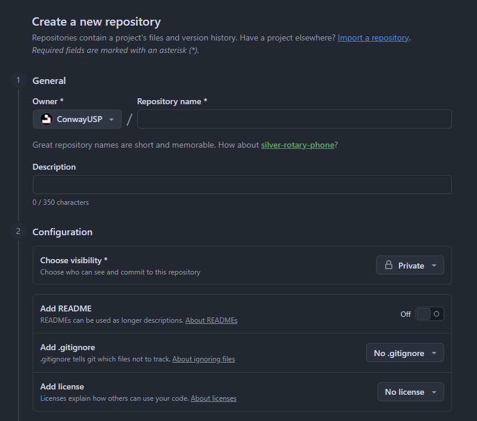
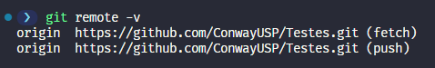
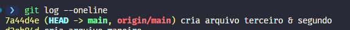
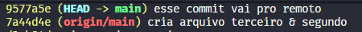

# Trabalhando Remotamente

Tudo que vimos até agora é muito útil para trabalhar sozinho, num projeto pessoal que está presente apenas na sua máquina. Contudo, no mundo real, iremos trabalhar com outros devs e colaborar com eles, ou simplesmente queremos "guardar" o código na "nuvem", para que ele esteja disponível em qualquer lugar, para que qualquer pessoa possa acessar. Para isso, precisamos aprender a trabalhar com repositórios remotos, e é isso que veremos nesse capítulo!

## Criando repositórios remoto

Para criar o seu primeiro repositório remoto, é simples: basta acessar https://github.com/new e um formulário como o da imagem abaixo irá aparecer:

- **Repository name**: esse será... bem, o nomo do seu repositório. Lembre-se que as pessoas que forem acessar o repositório irão vê-lo (inclusive na URL), então escolha um nome que seja fácil de entender e que faça sentido para o projeto;
- **Description**: aqui você pode escrever uma descrição do seu projeto, para que as pessoas saibam do que se trata. Ela é opcional, mas é uma boa prática sempre preenchê-la;
- **Public/Private**: um repositório privado é visto somente por você e pelos colabores do projeto, enquanto um repositório público pode ser visto por qualquer pessoa. Se o seu projeto é algo que você quer compartilhar com o mundo, ou se é um projeto open source, o ideal é que ele seja público. Já se é um projeto pessoal, ou algo que você não quer compartilhar, o ideal é que ele seja privado;
- **Add README**: como já explicado no capítulo [Criando um Repositório](02_criando_repositorio.md), o arquivo README é o cartão de visitas do seu projeto, onde as pessoas podem encontrar informações importantes sobre ele. Por isso, é uma boa prática sempre criar um README e deixá-lo bem escrito e organizado (aqui não vai ser necessário, mas fica a dica!);
- **Add .gitignore**: reforçando aqui, esse arquivo serve para dizer ao Git quais arquivos/pastas você não quer enviar para o seu repositório remoto (arquivos de configuração, módulos de instalação, arquivos de cache, dados sensíveis, etc). Ele é opcional, mas é uma boa prática sempre criá-lo e configurá-lo corretamente;
- **Add license**: novamente reforçando, a licença é um documento legal que define os termos de uso, distribuição e modificação do seu projeto, o seja, como e se as pessoas podem usá-lo. Para achar a licença ideal para o seu projeto, acesse [aqui](https://choosealicense.com/). Essa é a parte mais "burocrática" do processo, então podemos ignorá-la pelo menos por enquanto.

No no caso, podemos ignorar as opções de "adicionar" coisas, já que já fizemos tudo pelo repositório local, e o que queremos é apenas criar o repositório remoto. Depois de preencher as informações, basta criar o repositório remoto e pronto! No entanto, isso não significa que ambos os repositórios estão conectados, e é isso que veremos agora!

## Linkando repositórios local e remoto

Para realizar esse *link* entre os dois, iremos utilizar o comando [`git remote add origin <url-do-repositório-remoto>`](../guia_comandos/git_remote.md). Esse *origin* nada mais é que um nome simbólico para o repositório remoto, e a URL é o endereço do seu repositório remoto (mais um ".git" no final). Para verificar se deu certo, podemos usar `git remote -v` e verificar se o repositório remoto está listado, como na imagem abaixo:

Como é possível observar, o *fetch* e o *push* estão apontando para a mesma URL, o que é um bom sinal. O *fetch* é utilizado para buscar as atualizações do repositório remoto, ou seja, tudo que há de novo, enquanto o *push* é utilizado para enviar as suas alterações para o repositório remoto, ou seja, enviar as nossas mudanças. Agora que os repositórios estão conectados, podemos começar a trabalhar com eles e aproveitar todas as vantagens de ter um repositório remoto!

## Enviando alterações para o repositório remoto

Agora que os repositórios estão conectados, podemos enviar todos os nossos diversos commits feitos ao longo da trilha para o GitHub! Para isso, basta usar o comando [`git push -u origin <branch>`](../guia_comandos/git_push.md). Esse `-u` existe porque, a priori, o Git não sabe para ONDE deve enviar suas mudanças, e por isso devemos dizer à ele que é para a "origin" (apenas um nome simbólico para a URL do repositório remoto) que desejamos enviar as mudanças da nossa branch, nesse caso a "main". Por isso, essa flag só é necessária na primeira vez que fazemos o push de um branch, pois depois disso o Git já foi configurado para saber para onde enviar as mudanças daquele branch, e aí basta usar `git push` normalmente. Depois de executar o comando, basta atualizar a página do seu repositório remoto e verificar se as mudanças foram enviadas corretamente. No terminal, também é possível verificar se o push foi bem sucedido com o tão querido `git log --oneline`:

Como é possível ver, nossa branch **main** (que está em verde) possui um representante no repositório remoto, que é a **origin/main** (que está em vermelho), e o registro nos mostra que ambos estão apontando para o mesmo commit, ou seja, estão sincronizados. Agora, toda vez que fizermos um commit e quisermos enviar as mudanças para o repositório remoto, basta usar `git push` normalmente, sem a necessidade de usar o `-u` novamente. Para testar isso, vamos fazer um novo commit e verificar o histórico novamente:

Como é possível observar, a branch **origin/main** ficou para trás, já que o commit mais recente está somente no repositório local, na branch **main**. O fato da sincronização não ser feita automaticamente parece ser um pouco chato, mas na verdade é uma vantagem, pois te uma liberdade maior na hora de manipular seus commits, já que, enquanto eles estão no seu computador, você pode editá-los, reordená-los, deletá-los, etc, sem se preocupar com o repositório remoto. Depois que eles são enviados para o repositório remoto, é muito mais difícil e até mesmo perigoso fazer esse tipo de manipulação, já que outras pessoas podem ter acesso a esses commits e podem estar utilizando eles como base para os trabalhos delas, e aí qualquer mudança pode causar um grande estrago. Novamente, para voltar a sincronizar, bbasta usar `git push` normalmente, e depois de atualizar a página do repositório remoto, o commit mais recente estará lá!

## Clonando um repositório remoto

Agora que sabemos como criar e enviar nossas mudanças para um repositório remoto, vamos aprender a clonar um, ou seja, criar uma cópia local dele. Para isso, abra uma outra pasta, totalmente diferente da que estamos trabalhando nessa trilha (justamente para simular como se fosse outro computador tentando acessar nosso trabalho árduo). Depois disso, basta usar o comando [`git clone <url-do-repositório-remoto> .`](../guia_comandos/git_clone.md) e pronto, uma cópia perfeita de tudo aquilo que enviamos para o remoto está de volta para o local! Nessa outra versão, vamos fazer o seguinte teste (você vai entender o do porque dele já já): vamos criar um novo arquivo, fazer um commit e enviar para o repositório remoto (aqui não precisamos usar o `-u`, pois o `git clone` já verificou que existe um `origin/main` e linkou com o `main` local). Apenas isso por hora.

## Buscando alterações do repositório remoto

Terminamos de simular uma outra máquina trabalhando em conjunto conosco, e agora queremos trazer as mudanças que fizemos nessa máquina para a máquina original. Para isso, basta usar o comando [`git pull`](../guia_comandos/git_pull.md) e pronto, as mudanças feitas na outra máquina estão de volta para a máquina original! O `git pull` é um comando que faz duas coisas: primeiro ele busca as mudanças do repositório remoto (equivalente ao [`git fetch`](../guia_comandos/git_fetch.md)), e depois ele tenta mesclar essas mudanças com a sua branch local (equivalente ao [`git merge`](../guia_comandos/git_merge.md)). Se não houver nenhum conflito entre as mudanças, o processo é automático e tranquilo. No entanto, se houver algum conflito, o Git irá te avisar e você precisará resolver esses conflitos manualmente antes de finalizar o processo, igual já fizemos anteriormente. 