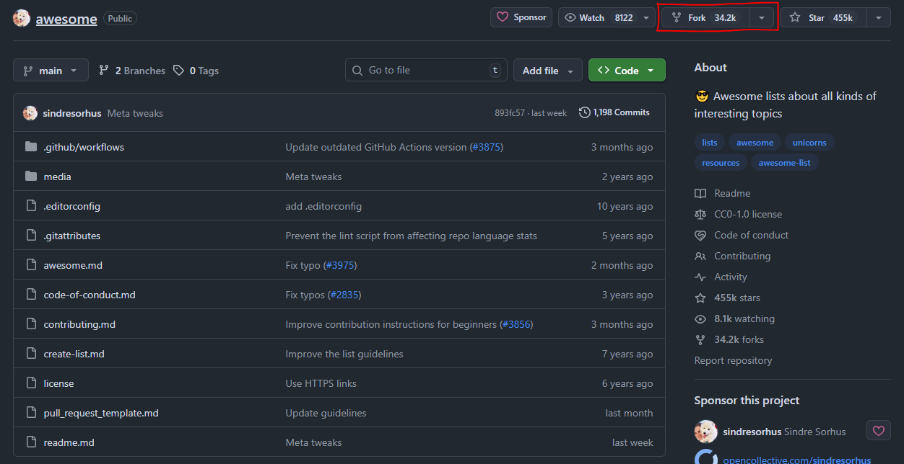
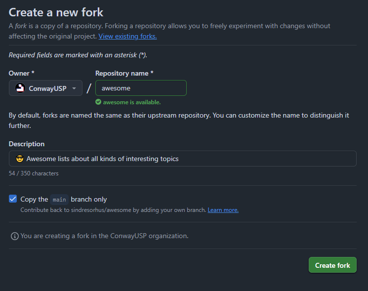
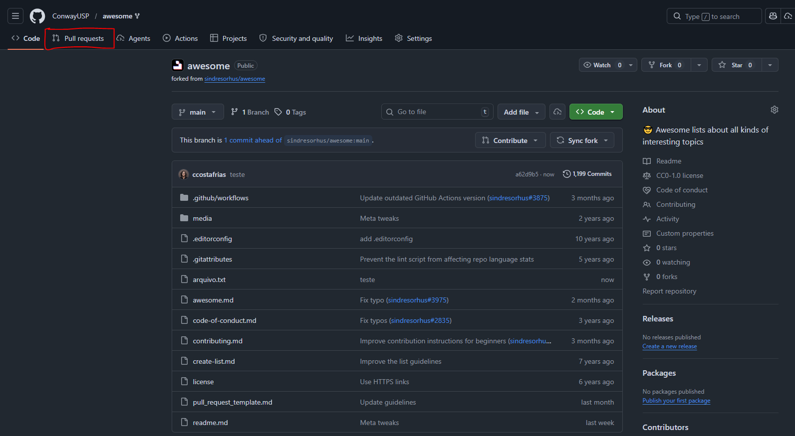
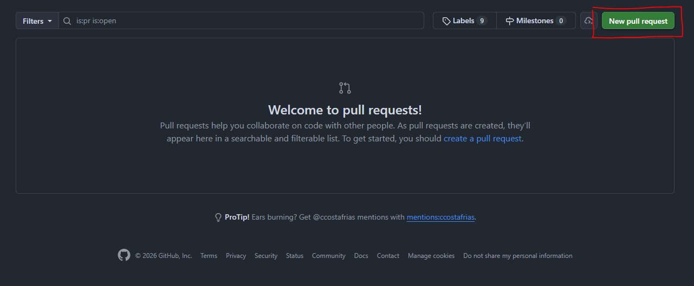
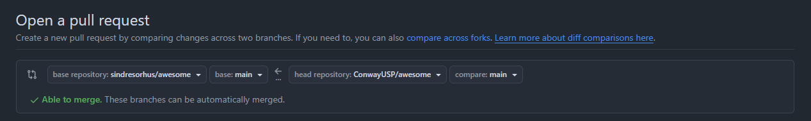

# Colaborando com os outros

Voltar ao [Guia Prático](README.md)
 
No último capítulo, foi possível aprender as bases de como utilizar repositórios remotos: como criar um, clonar, linkar o local ao remoto, enviar e buscar mudanlas. Agora, chegou a hora de aprender duas formas distintas de colaborar com o trabalho alheio.

## Forks

A primeira maneira que iremos abordar são os [forks](../glossario_conceitos/fork.md). Resumindo bastante, o que um *fork* faz é criar uma cópia sua de um repositório que não é seu, ou seja, um repositório que você não tem permissão de edição direta. Para criar o seu, basta acessar o repositório de sua escolha (aqui estamos visitando o [awesome](https://github.com/sindresorhus/awesome), um repositório bem bacana), e clicar no botão **Fork** no canto superior direito da página:

Após clicar, um pequeno formuário irá aparecer, como o da imagem abaixo:

> **Owner**: escolhe se o fork será criado na sua conta pessoal ou em uma organização da qual você faça parte;

Depois de criado o fork, ele estará disponível na conta escolhida no GitHub. Como você deve imaginar, agora é preciso trazer o código do fork para o local, para que seja possível trabalhar com ele. Para isso, basta usar o comando [`git clone <url-do-fork-na-sua-conta> .`](../guia_comandos/git_clone.md) e pronto, você tem uma cópia de um repositório onde você nunca relou o dedo! Agora, para manter o fork sempre atualizado, podemos usar o comando [`git remote add upstream <url-do-repo-original>`](../guia_comandos/git_remote.md), onde **upstream** será o apelido para o repositório ORIGINAL, enquanto **origin** parmanece sendo o apelido para a nossa versão pessoal. Dessa forma, quando quisermos buscar as mudanças do repositório original, basta "puxarmos" as mudanças do **upstream** usando o comando [`git pull upstream <branch>`](../guia_comandos/git_pull.md), e quando quisermos enviar as nossas mudanças para o nosso fork, basta usar o comando [`git push origin <branch>`](../guia_comandos/git_push.md) (ou usar a flag `-u` e configurar isso automaticamente). Dessa forma, é possível manter o fork sempre atualizado com as mudanças do repositório original, e também é possível enviar as suas próprias mudanças para o seu fork, sem afetar o repositório original.

## Pull Requests

No entanto, imagine que você fez uma mudança super legal no seu fork, e gostaria de compartilhar essa mudança com o repositório original, para que outras pessoas possam se beneficiar dela. Para isso, é necessário criar um [pull request](../glossario_conceitos/pull_request.md). Resumidamente, um pull request (PR) é um pedido que você faz para o repositório original aceitar as mudanças que você fez com tanto carinho e amor <3. Para criar um pull request, basta acessar a página do seu fork no GitHub e seguir para a aba **Pull requests**:

Nela, estarão listados todos os pull requests que foram criados para o seu fork. Como não fizemos nenhum ainda, não haverá nada aqui. Porém, em projetos grandes, é comum que hajam centenas e até MILHARES de PRs, alguns em aberto, que ainda estão sendo revisados e analisados, e outros fechados, ou porque já foram implementados ou porque não cumpriam com algo e foram rejeitados. Para criar um novo pull request, basta clicar no botão **New pull request**:

Nessa nova tela, aparecerá mais um formulário, agora para criar o pull request. Nessa caixa superior, é possível escolher o **base repository**, ou seja, aquele no qual você quer que as mudanças sejam implementadas (de onde foi *forkado*), e o **head repository**, ou seja, aquele onde as mudanças foram feitas (no caso, o fork). Depois disso, basta escolher a branch do **base** e a branch do **head** e, se estiver tudo certo, o GitHub irá deixar prosseguir com o PR, mas se houver alguma incosistência, como por exemplo a branch do **head** já estar atualizada com a branch do **base**, ou o histórico das duas for completamente diferente, o GitHub irá avisar que não é possível criar o PR e irá impedir que ele seja criado (o que por si só é um mal sinal, então revise bem o que está fazendo).

Logo abaixo, há uma aba para adicionar uma descrição. Em repositórios grandes, é comum que haja uma template para preencher, já que esses recebem centenas de PRs e por isso precisam ser regirosos com o conteúdo do código e da sua descrição, por segurança e para facilitar a vida de quem irá avaliar. Por isso, se você for criar um PR sério, é importante se atentar nisso para não jogar seu precioso tempo no lixo. Depois que tudo foi revisado com muito cuidado e esmero, seu PR será criado assim que clicar em **Create pull request**.

> Atenção: como essa trilha possui fins apenas educativos, não é recomendado criar PRs de verdade para repositórios reais, afinal nenhuma contribuição foi feita de fato, e isso pode acabar atrapalhando o trabalho de outras pessoas. Se quiser praticar a criação e revisão de PRs, faça nos seus próprios repositórios.

Outro ponto importante é: falamos sobre criar PRs apenas em forks, mas a realidade é que ele pode ser criado em qualquer tipo de repositório. Quando se trabalha em equipe, não usamos o `git merge` direto, afinal, nosso código pode apresentar problemas, inconsistências, ou simplesmente não ser tão bom, e por isso é importante que haja uma revisão de código antes de qualquer mudança ser implementada. Para isso servem os PRs: você envia todo seu trabalho árduo para alguém revisar e, se aprovado, ai sim ele é implementado com um `git merge` por trás dos panos. Por isso, sempre que for trabalhar em equipe, faça um PR para suas mudanças, por mais mundana que seja.
