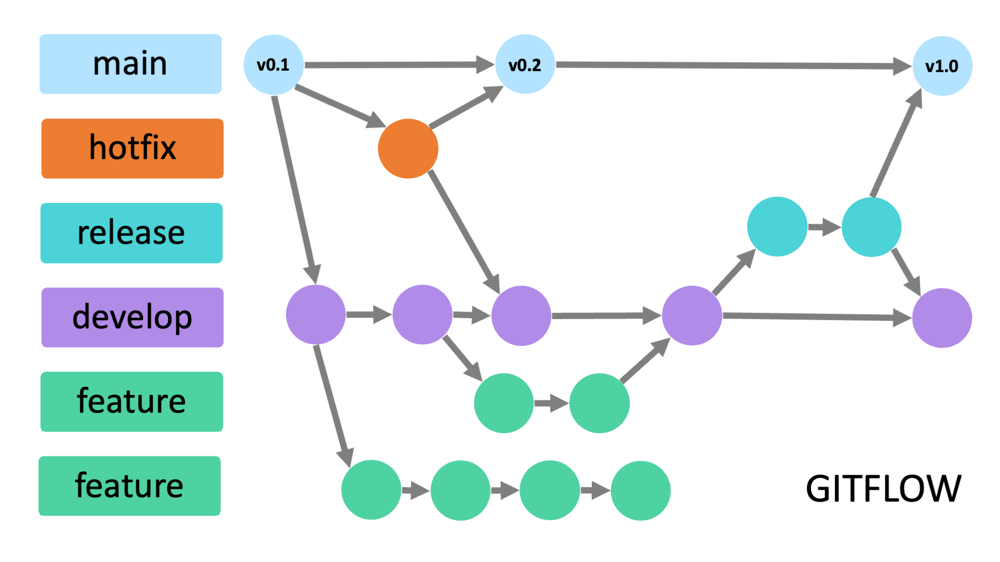
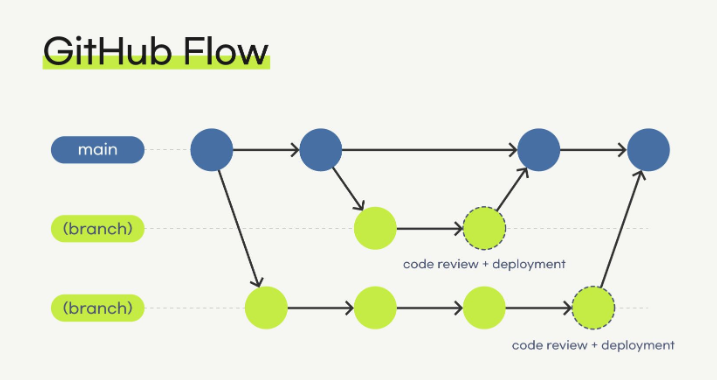
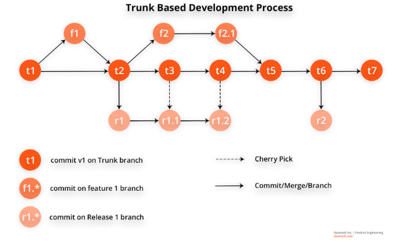

## O que é um Workflow?

Voltar ao [Guia Prático](README.md)

Um workflow (ou fluxo de trabalho) é um conjunto de regras e práticas que uma equipe adota para gerenciar as alterações no código de forma organizada e previsível. Ele define como e quando os desenvolvedores devem criar ramificações (branches), como essas ramificações interagem entre si e quais são os passos necessários para que um novo código seja revisado, testado e chegue à versão de produção. Escolher a estratégia de branching certa evita conflitos constantes e garante que o software seja entregue de forma eficiente.

Sem isso, há o risco de o código no qual passamos horas trabalhando possa ser perdido, que é o que nos motiva para aprender controle de versão para armazenar nosso código e gerenciar alterações.

Para organizar a forma como as equipes colaboram, existem estratégias de ramificação (branching). As que iremos abordar nessa aula são: **Git Flow**, **GitHub Flow** e **Desenvolvimento baseado em troncos** (trunk based development). Embora seja importante salientar que essas não são as únicas estratégias de ramificação que existem, e que não necessariamente exista uma melhor, mas assim existe aquela que se adequa melhor para nossa situação e o projeto que estamos tentando desenvolver.

## 1. Gitflow

O Gitflow é um fluxo de trabalho legado do Git. Ele é especialmente útil para projetos que possuem um ciclo de lançamento (release) agendado. Se a sua equipe precisa que uma equipe de QA (Garantia de Qualidade) faça testes manuais antes que o código vá para produção, o Gitflow pode ser uma boa escolha.

#### Como funciona?

A ideia central do Gitflow é utilizar várias e diversas ramificações, com cada uma com função específica e focada no seu escopo. Temos:

- **main (ou master):** Armazena o histórico do lançamento oficial e deve corresponder ao código que está em produção.
    
- **develop:** Serve como uma ramificação de integração para recursos e armazena uma cópia da `main` com todas as alterações adicionadas desde o último lançamento.
    
- **feature:** Os desenvolvedores criam essas ramificações a partir da `develop` para trabalhar em novos recursos. Quando concluído, o recurso passa por merge de volta para a ramificação `develop`.
    
- **release:** Quando a `develop` adquire recursos suficientes para um lançamento, uma ramificação de lançamento é criada a partir dela. Após os testes, ela passa por merge para a `main` (sendo marcada com um número de versão) e também de volta para a `develop`.
    
- **hotfix:** São usadas para corrigir rapidamente lançamentos de produção e são bifurcadas diretamente da `main`. Após a correção, o merge é feito tanto na `main` quanto na `develop`

Fonte: https://blog.kinto-technologies.com/posts/2023-03-07-From-Git-flow-to-GitHub-flow/

#### Exemplo

Imagine que você juntou um pessoal da Conway e decidiu desenvolver um aplicativo de e-commerce chamado **ConwayShop**, onde será vendido camisas da Conway, sapatos da Conway, mascotes da Conway, cadernos/mochilas da Conway, mesa de sinuca da Conway, etc. Vamos ver como as ramificações seriam usadas na prática:

- **`main`:** O aplicativo está no ar e os queridos membros da nossa entidade e da USP estão fazendo compras nele! O código atual da `main` é a **versão 1.0.0**. Tudo que está aqui é código de produção.
    
- **`develop`:** A equipe já está trabalhando nas novidades para o próximo mês, agora teremos uma nova aba que chamada **Lobby da Conway**, onde membros e fãs da Conway poderão interagir uns com os outros e conversar sobre coisas. A ramificação `develop` possui todo o código da versão 1.0.0, além de uma estrutura inicial para a próxima grande atualização.
    
- **`feature`:** * A desenvolvedora Joanna Connie Way recebe a tarefa de adicionar um sistema de pagamento via Pix. Ela cria uma ramificação chamada `feature/pagamento-pix` a partir da `develop`.
    
    - A desenvolvedora Clara Obscura Expedita precisa criar um modo noturno para o app. Ela cria a `feature/dark-mode` também a partir da `develop`.
        
    - Quando terminam suas tarefas, ambas fazem o merge de seus códigos de volta para a `develop`.
        
- **`release`:** A equipe decide que a base do Lobby da Conway, junto com o pagamento via Pix e o modo noturno, já são suficientes para a próxima atualização. Eles criam uma ramificação `release/1.1.0` a partir da `develop` e entregam para a equipe de QA (Qualidade) testar. Nenhum recurso novo entra aqui, apenas correções de bugs encontrados nos testes. Quando tudo estiver perfeito, a `release/1.1.0` sofre merge para a `main` (ganhando a tag de versão 1.1.0) e também sofre merge de volta para a `develop`.
    
- **`hotfix`:** De repente, em uma sexta-feira à noite, os usuários relatam que não conseguem finalizar compras na versão que está no ar (a versão 1.0.0 da `main`). A equipe não pode esperar a `release/1.1.0` ficar pronta para resolver isso. Um desenvolvedor chamado Silvio Song cria a ramificação `hotfix/erro-carrinho` diretamente a partir da `main`. Ele corrige o problema em poucas horas, faz o merge de volta para a `main` (lançando a versão 1.0.1 imediatamente para os usuários) e também faz o merge para a `develop`, garantindo que esse bug não volte a acontecer nas atualizações futuras.

### Vantagens do Gitflow

- Permite que você trabalhe em vários lançamentos em paralelo.
    
- Fornece um controle de versão claro, pois cada lançamento é testado individualmente, marcado (tagged) e fácil de rastrear.
    
- Permite que vários desenvolvedores trabalhem no mesmo recurso.
    

### Desvantagens do Gitflow

- Não é adequado para entrega contínua ou implementação contínua.
    
- Você precisa manter muitas ramificações e lembrar de fazer o merge de volta para manter a consistência, o que é algo meio cansativo.
    
- A sobrecarga necessária para lançar pode levar a um acúmulo de dívida técnica.

## 2. GitHub Flow

Já o GitHub Flow em contrapartida é um fluxo de trabalho leve e baseado em branches. Ele é ideal para equipes que buscam entrega e implementação contínuas, permitindo que os lançamentos ocorram várias vezes ao dia

#### Como funciona?

De forma oposta ao Gitflow que possuia vários tipos de ramificações, no GitHub Flow teremos algo bem mais simples, onde trabalharemos basicamente com apenas dois tipos de ramificações. Temos:

- **main (ou master):** Contém todo o código implementável para o projeto.
    
- **feature (ou branch de trabalho):** Os desenvolvedores criam um branch diretamente a partir da `main` para trabalhar em novos recursos ou correções.

O processo geralmente segue estas etapas:

1. **Criar um branch:** Crie um branch no seu repositório a partir da ramificação padrão, usando um nome curto e descritivo.
    
2. **Fazer alterações:** Faça os commits e o push das alterações no seu branch, garantindo que seja um espaço seguro para testar ideias.
    
3. **Criar uma solicitação de pull (Pull Request):** Crie um pull request para pedir aos colaboradores feedback sobre suas alterações.
    
4. **Revisão:** Os revisores devem deixar perguntas, comentários e sugestões, e você pode continuar fazendo commits em resposta a essas revisões.
    
5. **Merge:** Depois que o pull request for aprovado e testado, faça o merge para que as alterações apareçam no branch padrão, o que significa que deve ir para produção imediatamente.
    
6. **Excluir o branch:** Após o merge, exclua o branch para indicar que o trabalho foi concluído e evitar o uso de branches antigos acidentalmente.

Fonte: https://velog.io/@fenjo/%ED%98%91%EC%97%85%EC%9D%84-%EC%9C%84%ED%95%9C-Git-flow-GitHub-flow-Git-branch-%EC%82%AC%EC%9A%A9%EB%B2%95

**Exemplo:**

1. **Criar um branch:** A desenvolvedora Joanna Connie Way precisa adicionar a página de inscrição para a próxima Game Jam no site da Conway. Como a regra aqui é agilidade, ela cria a ramificação `feature/pagina-game-jam` **diretamente a partir da `main`**.
    
2. **Fazer alterações:** Ela escreve o código, adiciona o banner do evento, faz os commits e dá o push das alterações no seu branch. Ali é o espaço seguro dela para testar o layout sem quebrar o site principal.
    
3. **Criar uma solicitação de pull (Pull Request):** Com a página funcional, ela cria um pull request para pedir aos outros membros da equipe feedback sobre o que foi feito.
    
4. **Revisão:** Os revisores (como o Silvio Song) entram no PR, testam e sugerem mudar a cor do botão de inscrição para combinar melhor com a identidade visual da entidade. Joanna concorda, faz a alteração no código e manda um novo commit. A solicitação de pull é atualizada automaticamente com a correção.
    
5. **Merge:** Depois que o pull request for aprovado pela equipe, é feito o merge. As alterações da página da Game Jam entram na ramificação `main`. Como a regra do GitHub Flow é que a `main` deve estar sempre pronta para uso, a nova página vai para produção imediatamente e já fica online para o público acessar.
    
6. **Excluir o branch:** Após o merge, a ramificação `feature/pagina-game-jam` é excluída. Isso indica que o trabalho daquele recurso foi 100% concluído e evita que o repositório da Conway fique poluído com branches antigos, impedindo usos acidentais no futuro.

Ou seja, podemos ver a diferença essencial entre o Gitflow e o GitHub flow aqui, não tem `develop`, nem `release` nem nada acumulando coisas. Fez, testou, aprovou, tá no ar, bola em campo e gol na rede.

### Vantagens do GitHub Flow

- Permite a entrega e implementações contínuas.
    
- Quase não é necessário gerenciamento de ramificações, exceto a limpeza das ramificações de recursos após o lançamento.
    
- Encoraja as equipes a lançar rapidamente e obter feedback sobre o trabalho.
    

### Desvantagens do GitHub Flow

- Exige uma estrutura sólida de testes automatizados e um processo de lançamento automatizado.
    
- Não se adapta bem a grandes recursos nos quais vários desenvolvedores precisem trabalhar em paralelo.
    
- Exige diligência extra, pois qualquer bug que passar pelo merge na `main` irá direto para a produção.

## 3. Desenvolvimento Baseado em Tronco (Trunk-Based Development)

Para finalizar, falaremos do desenvolvimento baseado em tronco ~~(eita nome grande da miséria, me dar preguiça de digitar aaaaa)~~.  O desenvolvimento baseado em tronco é uma prática de gerenciamento de controle de versão em que os desenvolvedores fazem o merge de atualizações pequenas e frequentes diretamente no "tronco" (ba dum tss 🥁 ) ou ramificação principal. Essa prática difere de outras estratégias onde os recursos ou correções de bugs são desenvolvidos em branches separados e mesclados na ramificação principal apenas em um estágio posterior.

Neste modelo, a submissão de alterações no branch principal aciona o pipeline de **CI/CD**. Se o pipeline sinalizar alguma falha, é responsabilidade de todos tentar consertá-la o mais rápido possível.

#### Mas Eduardo, o que cacete é um CI/CD?

~~É uma palavra que eu inventei~~ CI/CD significa **Continuous Integration/ Continuous Delivery (ou Deployment)**, pense nele  da seguinte forma:

 - **CI (Integração Contínua - _Continuous Integration_):** Toda vez que a Joanna ou o João enviam um código novo para o repositório, o sistema compila o projeto e roda uma série de testes automáticos. Isso garante que o código novo se "integra" bem com o código antigo e não quebra nada que já estava funcionando.
   
- **CD (Entrega/Implantação Contínua - _Continuous Delivery/Deployment_):** Se o código passou em todos os testes do CI,  essa nova versão já é publicada direto para o servidor de produção, chegando aos usuários de forma rápida e segura.     

Se o pipeline sinalizar alguma falha durante os testes automáticos, a esteira para. Nesse momento, é responsabilidade de toda a equipe parar o que está fazendo e consertar o código o mais rápido possível. O objetivo número um dessa estratégia é manter o branch `main` sempre em um estado impecável, pronto para ser lançado a qualquer segundo.

###### E o que raios é um pipeline senhor Du Almeida?????????

~~Tive duas matérias que ensinavam isso e ainda não entendi direito~~ De forma bem breve e pra que esse desvio que a gente tomou não se estenda mais ainda, Pipeline é basicamente (nesse nosso contexto pelo menos, em outros ele pode ter outro significado, mas não vale a pena se preocupar com isso para essa aula) uma sequência automatizada de passos executados em ordem por um servidor. Quando um código novo é enviado, o pipeline dispara scripts que, geralmente, compilam o projeto, executam testes e realizam o deploy. Se qualquer etapa falhar, a execução é interrompida imediatamente.

### Práticas Recomendadas 

Para que o desenvolvimento baseado em tronco funcione sem introduzir falhas na produção, as equipes devem seguir algumas práticas rigorosas:

- **Desenvolver em pequenos lotes:** Alterações pequenas minimizam a sobrecarga cognitiva e tornam mais fácil para as equipes terem conversas significativas e tomarem decisões rápidas durante a revisão.
    
- **Fazer merges diários:** Equipes de alto desempenho devem fechar e fazer o merge de qualquer ramificação aberta e pronta para o tronco no mínimo todos os dias.
    
- **Uso de Sinalizadores de Função (Feature Flags):** Permitem que os desenvolvedores coloquem novas alterações em um caminho de código inativo para que ele seja ativado mais tarde. Isso fornece uma maneira de controlar a visibilidade de recursos grandes ou complexos que você ainda não deseja tornar visíveis para os usuários.
    
- **Testes automáticos abrangentes:** O conjunto de testes automatizado analisa o código para quaisquer problemas e faz a aprovação ou negação automáticas, permitindo que os desenvolvedores criem commits com rapidez. É importante monitorar as métricas de cobertura do teste e garantir que todos compilem localmente antes da submissão para reduzir o número de problemas encontrados na ramificação principal.
    
- **Revisões de código ágeis:** A revisão de código deve ser realizada imediatamente. Os testes automatizados oferecem uma camada preventiva, garantindo ao revisor que o novo código atende a certas especificações antes de focar em otimizações.
    
- **Manter a limpeza de ramificações:** É recomendado ter três ou menos ramificações ativas no repositório, sendo a exclusão da ramificação uma prática recomendada assim que ela passa por merge.

Fonte: https://fity.club/lists/suggestions/trunk-based-development/

####  Exemplo

A equipe da Conway agora está desenvolvendo um novo e complexo Sistema de Votação para avaliar os jogos enviados na próxima Game Jam. Como eles já possuem um pipeline de CI/CD muito bem configurado e confiável (quem nos dera), decidiram usar o Trunk-Based Development.

- **Pequenos lotes no Tronco:** Em vez de criar uma ramificação `feature/sistema-de-votacao` que vai durar semanas isolada, o desenvolvedor Dom Kong Bacana cria apenas a lógica de banco de dados da votação e faz o commit **diretamente na ramificação `main`** (ou abre um Pull Request muito pequeno que é aprovado na mesma hora).
    
- **Ação do Pipeline:** Assim que o código entra na `main`, o pipeline é acionado. Os testes automatizados (CI) rodam e confirmam que o site principal não quebrou. Em seguida, a esteira de entrega (CD) já publica essa alteração no servidor.
    
- **Sinalizadores de Função (Feature Flags):** Mas espere, se o código já foi para produção, os usuários da Conway já conseguem ver a votação incompleta? Não senhor(a)! A desenvolvedora Maria Bloodborne envolveu todo esse código novo em um _Feature Flag_ (uma variável no código que diz `mostrar_sistema_de_votacao = false`). O código novo já está lá, integrado e testado, mas fica invisível para o público.
    
- **Resolução Rápida de Falhas:** No dia seguinte, Dom tenta adicionar o botão de "Dar Estrelas", mas comete um erro na lógica. Ao mandar para a `main`, o pipeline de CI roda, os testes falham e **a esteira trava**. A equipe inteira recebe um alerta. Dom para o que está fazendo, corrige o botão em poucos minutos, envia o conserto para a `main` e o pipeline volta a ficar verde.
    
- **O Lançamento:** A equipe passa dias construindo a página de votação pedacinho por pedacinho, sempre jogando direto na `main`. Quando o evento da Game Jam finalmente começa, eles não precisam fazer um "merge" gigante e arriscado de uma ramificação antiga. Eles simplesmente mudam a variável do Feature Flag para `mostrar_sistema_de_votacao = true`. A página aparece magicamente para todos os usuários, sem estresse e sem quebrar nada.

#### Quando usar e quando evitar?

- **Ideal para:** Produtos de SaaS, nos quais há uma alta tolerância e até mesmo uma expectativa de atualizações contínuas.

_O que é Saas?:_  [SaaS: o que é, como funciona e benefícios para sua empresa](https://www.hostinger.com/br/tutoriais/saas-o-que-e)
    
- **Menos indicado para:** Produtos instalados ou aplicativos móveis, situações em que é melhor agrupar as alterações em lançamentos periódicos e manter suporte contínuo para várias versões do produto usando branches separados.
    
- **Atenção:** Para equipes que são novas em CI/CD, submeter as alterações diretamente no master mantendo-o implantável pode ser um desafio se ainda não houver tempo de desenvolver um conjunto de testes robusto.

## Considerações Finais e Gerais

Como você já deve ter percebido, não necessariamente existe um Workflow melhor que o outro. Que nem eu mencionei, varia muito de caso pra caso e qual se adequa melhor a cada situação, mas ainda assim, creio que esses três workflows mencionados na aula já sejam muito úteis para qualquer projeto em equipe que você for trabalhar no futuro, e também após aprender sobre eles, aprender qualquer outro novo Workflow que surgir ou que você encontrar será um pouco mais fácil.

## Referências Bibliográficas

[Fluxo de trabalho Gitflow | Tutorial da Atlassian sobre o Git](https://www.atlassian.com/br/git/tutorials/comparing-workflows/gitflow-workflow)

[fluxo de GitHub - Documentos do GitHub](https://docs.github.com/pt/get-started/using-github/github-flow)

[Git Flow vs GitHub Flow | Alex Hyett](https://www.alexhyett.com/git-flow-github-flow/)

[Desenvolvimento baseado em troncos | Atlassian](https://www.atlassian.com/br/continuous-delivery/continuous-integration/trunk-based-development)

[O que é Desenvolvimento Baseado em Troncos? | Guia de CI/CD do TeamCity | JetBrains](https://www.jetbrains.com/pt-br/teamcity/ci-cd-guide/concepts/trunk-based-development/)

